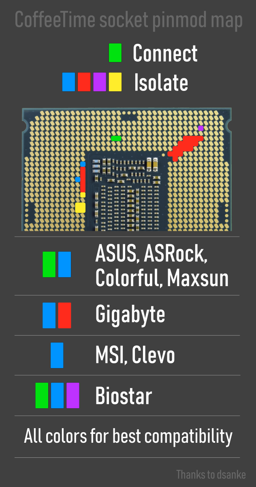
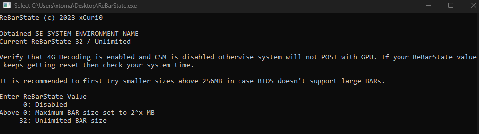
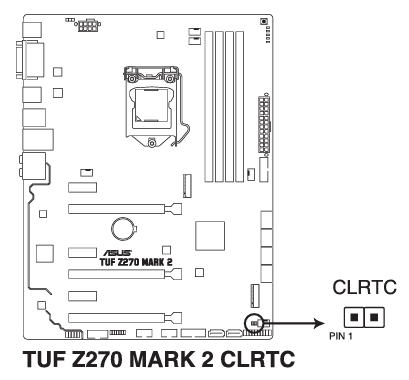

<h1 align="center">ReBarUEFI + Coffee Lake support ASUS TUF Z270 Mark 2</h1>
<p align="center">
<a href="https://github.com/xCuri0/ReBarUEFI/actions/workflows/ReBarDxe.yml"></a>
<a href="https://github.com/xCuri0/ReBarUEFI/actions/workflows/ReBarState.yml"></a>
</p>
<p align="center">
A UEFI DXE driver to enable Resizable BAR on systems which don't support it officially. This provides performance benefits and is even <a href="https://www.intel.com/content/www/us/en/support/articles/000092416/graphics.html">required</a> for Intel Arc GPUs to function optimally.
</p>
> [!WARNING]
> Not compatible with Nvidia Turing GPUs (GTX 1600 and RTX 2000)


# Requirements
*  A USB Drive
*  [Rufus](https://rufus.ie/en/)
* **(Required for Intel ARC)** Working iGPU
* **(Required)** A Skylake (6th gen) or Kaby Lake (7th gen) CPU
* **(Optional)** a Coffee Lake CPU (8th or 9th gen)
> [!CAUTION]
> This BIOS will only work with the **Mark 2** version of the board and **it won't work with the Mark 1**


# Usage
## Prepairing the USB drive
* Format your USB drive with Rufus as shown in this screenshot:


* Drag and drop the contents of [Installer.zip](https://github.com/xtomasnemec/ASUS-TUF-Z270-Mark-2-ReBarUEFI/releases/) for Skylake (6th gen) and Kaby Lake (7th gen) CPU or [Installer8thGEN.zip](https://github.com/xtomasnemec/ASUS-TUF-Z270-Mark-2-ReBarUEFI/releases/) for Coffee Lake (8th and 9th gen) CPU to the Root of the USB drive. It should look like this:


## Instalation

 ### Coffee Lake (8th and 9th gen) preparation
  > [!IMPORTANT]
  > Skip this if you are using a Skylake (6th gen) or Kaby Lake (7th gen) CPU

> [!WARNING]
> You will need a Skylake (6th gen) or Kaby Lake (7th gen) CPU for the instalation process
* Boot to BIOS
    * Enable CSM ```Advanced mode/Boot/CSM/Launch CSM - Enabled/Auto```
    * Enable Above 4G encoding ```Advanced mode/Boot/Above 4G Decoding - Enabled```
      * Save changes and exit
> [!WARNING]
> If you are using Intel ARC you will have to plug in your iGPU
  * Enter the BIOS and boot form the USB
      * Wait for the update to finish and reboot
> [!CAUTION]
> ***Do not!*** power off your computer while updating. This will brick your motherboard. If this happens your motherboard will enter BIOS Recovery mode and it will try to reflash the stock BIOS from the USB (I included the 1301 BIOS in [Installer.zip](https://github.com/xtomasnemec/ASUS-TUF-Z270-Mark-2-ReBarUEFI/releases/) so you can reflash it without using a second PC)
>
> **I accept no responsibility for bricked motherboards**

  * Boot to BIOS and disable CSM ```Advanced mode/Boot/CSM/Launch CSM - Disabled```
* Enable Above 4G encoding ```Advanced mode/Boot Above 4G Decoding - Disabled```
      * Save changes and exit
      * Now you can plug in your monitor to the dGPU **(Intel ARC only)**
   
* Prepare the Coffee Lake (8th and 9th gen) CPU by covering/conecting different pads on the CPU as shown (Green/Blue)
      
  * Install the CPU

### Skylake and Kaby Lake (6th and 7th gen)
  > [!IMPORTANT]
  > Skip this if you are using a Coffee Lake (8th and 9th gen) CPU
  * Boot to BIOS
    * Enable CSM ```Advanced mode/Boot/CSM/Launch CSM - Enabled/Auto```
    * Disable Above 4G encoding ```Advanced mode/Boot/Above 4G Decoding - Disabled```
      
      * Save changes and exit
> [!WARNING]
> If you are using Intel ARC you will have to plug in your iGPU
  * Enter the BIOS and boot form the USB
      * Wait for the update to finish and reboot
> [!CAUTION]
> ***Do not!*** power off your computer while updating. This will brick your motherboard. If this happens your motherboard will enter BIOS Recovery mode and it will try to reflash the stock BIOS from the USB (I included the 1301 BIOS in [Installer8thGEN.zip](https://github.com/xtomasnemec/ASUS-TUF-Z270-Mark-2-ReBarUEFI/releases/) so you can reflash it without using a second PC)
>
> **I accept no responsibility for bricked motherboards**

  * Boot to BIOS and disable CSM ```Advanced mode/Boot/CSM/Launch CSM - Disabled```
* Enable Above 4G encoding ```Advanced mode/Boot/Above 4G Decoding - Enabled```     
 * Save changes and exit
 * Now you can plug in your monitor to the dGPU **(Intel ARC only)**

## Configuration
  * Configure ReBAR with [Configurator.exe](https://github.com/xtomasnemec/ASUS-TUF-Z270-Mark-2-ReBarUEFI/releases)

    
    
     * You can choose a size of the BAR there (I used value of ```32``` with my Arc A750)
        * Reboot after saving changes
   
# Troubleshooting
## I set an unsupported BAR size and my system won't boot
Clear CMOS and Resizable BAR should be disabled. Short the two pins labeled as ```CLRTC``` or boot with the iGPU and set the correct BAR size



## My BIOS is corrupted
I included the 1301 BIOS in [Installer.zip](https://github.com/xtomasnemec/ASUS-TUF-Z270-Mark-2-ReBarUEFI/releases/) and the board should flash it automaticaly Using the ```CrashFree BIOS 3``` utility

# FAQ

## Can i flash the BIOS from Windows
Yes but i do not recomend it because it is dangerous. But if you want to do it this way you can use AFUWIN using the /GAN command [No direct link because of DMCA](https://letmegooglethat.com/?q=AMI+Aptio+IV+BIOS+Tool+v3.05.04+archive.org)

## Can I use Resizable BAR on my system without modifying BIOS ?
You can use Linux with **4G Decoding on**, recent versions will automatically resize and allocate GPU BARs. **Currently there is no known method to get it on Windows without BIOS modification**

## I want to revert to the original BIOS
You can do that but remember that you have to disable ReBAR with [Configurator.exe](https://github.com/xtomasnemec/ASUS-TUF-Z270-Mark-2-ReBarUEFI/releases), use a Skylake (6th gen) or Kaby Lake (7th gen) CPU and then you can revert to the original BIOS

# Credit
* [@xCuri0](https://github.com/xCuri0) for [ReBarUEFI](https://github.com/xCuri0/ReBarUEFI)
* [American Megatrends](https://www.ami.com/) for the AFUDOS Utility
* [ASUS](https://www.asus.com/) for the [Original BIOS](https://www.asus.com/in/supportonly/tuf%20z270%20mark%202/helpdesk_bios/)
* svarmod for [CoffeeTime](https://mega.nz/folder/4oRViKSI#nn-8ZRHBa6_PDwNLzgubNA)
