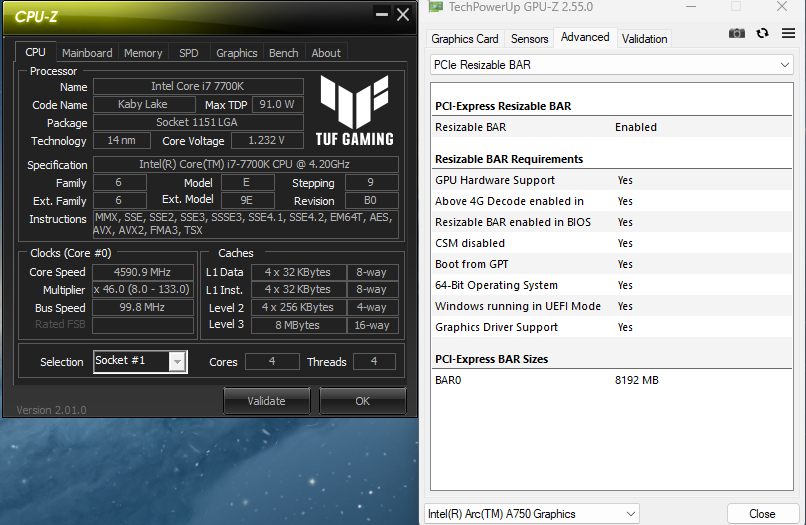
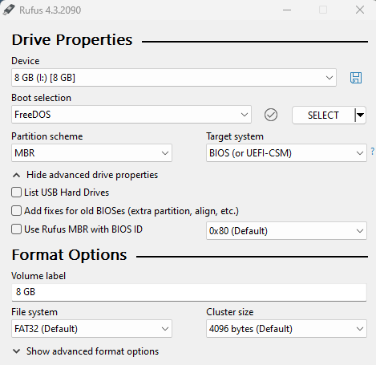
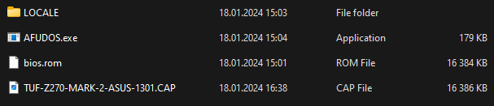

<h1 align="center">ReBarUEFI ASUS TUF Z270 Mark 2</h1>
<p align="center">
<a href="https://github.com/xCuri0/ReBarUEFI/actions/workflows/ReBarDxe.yml"></a>
<a href="https://github.com/xCuri0/ReBarUEFI/actions/workflows/ReBarState.yml"></a>
</p>
<p align="center">
A UEFI DXE driver to enable Resizable BAR on systems which don't support it officially. This provides performance benefits and is even <a href="https://www.intel.com/content/www/us/en/support/articles/000092416/graphics.html">required</a> for Intel Arc GPUs to function optimally.
</p>




# Requirements
*  4G Decoding enabled
*  Enable CSM Before installing and disable it afterwards
*  A USB Drive
*  [Rufus](https://rufus.ie/en/)


# Usage
## Prepairing the USB drive
* Format your USB drive with Rufus as shown in this screenshot:




* Drag and drop the contents of [Installer.zip](https://github.com/xtomasnemec/Asus-TUF-Z270-Mark-2-ReBarUEFI/releases/) to the Root of the USB drive. It should look like this:



## Instalation
  * Boot to BIOS
    * Enable CSM ```Advanced mode/Boot/CSM/Launch CSM```
    * Enable Above 4G encoding ```Advanced mode/Boot/Above 4G Decoding```
      * Save changes and exit
  * Enter the BIOS and boot form the USB
      * Wait for the update to finish
> [!CAUTION]
> ***Do not!*** power off your computer while updating. This will brick your motherboard. If this happens your motherboard will enter BIOS Recovery mode and it will try to reflash the stock BIOS from the USB (I included the 1301 BIOS in [Installer.zip](https://github.com/xtomasnemec/Asus-TUF-Z270-Mark-2-ReBarUEFI/releases/) so you can reflash it without using a second PC)
>
> **I accept no responsibility for bricked motherboards**

  * Boot to BIOS and disable CSM ```Advanced mode/Boot/CSM```
      * Save changes and exit
  * Configure ReBar with [Configurator.exe](https://github.com/xtomasnemec/Asus-TUF-Z270-Mark-2-ReBarUEFI/releases)
  
# FAQ
## Will it work on my CPU?
Yes it doesn't matter which of of [these](https://www.asus.com/in/supportonly/tuf%20z270%20mark%202/helpdesk_bios/) CPUs do you use.

## Can i flash the BIOS from Windows
Yes but i do not recomend it because it is dangerous. But if you want to do it this way you can use AFUWIN using the /GAN command [No direct link because of DMCA](https://letmegooglethat.com/?q=AMI+Aptio+IV+BIOS+Tool+v3.05.04+archive.org)

## Can I use Resizable BAR on my system without modifying BIOS ?
You can use Linux with **4G Decoding on**, recent versions will automatically resize and allocate GPU BARs. If your BIOS doesn't have the 4G decoding option (make sure to check [hidden](https://github.com/xCuri0/ReBarUEFI/wiki/Enabling-hidden-4G-decoding)) or DSDT is faulty you can then follow the [Arch wiki guide for DSDT modification](https://wiki.archlinux.org/title/DSDT#Recompiling_it_yourself) using modifications from [DSDT Patching](https://github.com/xCuri0/ReBarUEFI/wiki/DSDT-Patching) and boot with ```pci=realloc``` in your kernel command line. **Currently there is no known method to get it on Windows without BIOS modification**

## I set an unsupported BAR size and my system won't boot
Clear CMOS and Resizable BAR should be disabled. In some cases it may be necessary to remove the CMOS battery for Resizable BAR to disable.

## I want to revert to the original BIOS
You can do that but remember that you have to disable ReBAR with [Configurator.exe](https://github.com/xtomasnemec/Asus-TUF-Z270-Mark-2-ReBarUEFI/releases) and then you can revert to the original BIOS

## Credit
* [@xCuri0](https://github.com/xCuri0) for [ReBarUEFI](https://github.com/xCuri0/ReBarUEFI)
